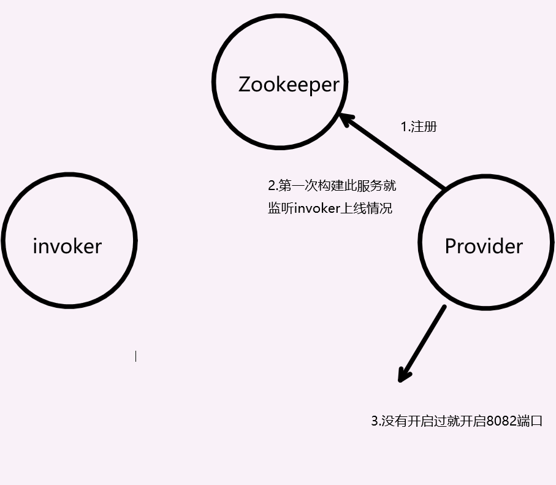
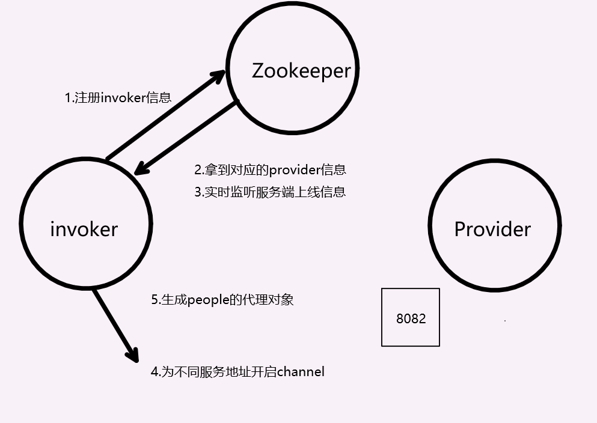
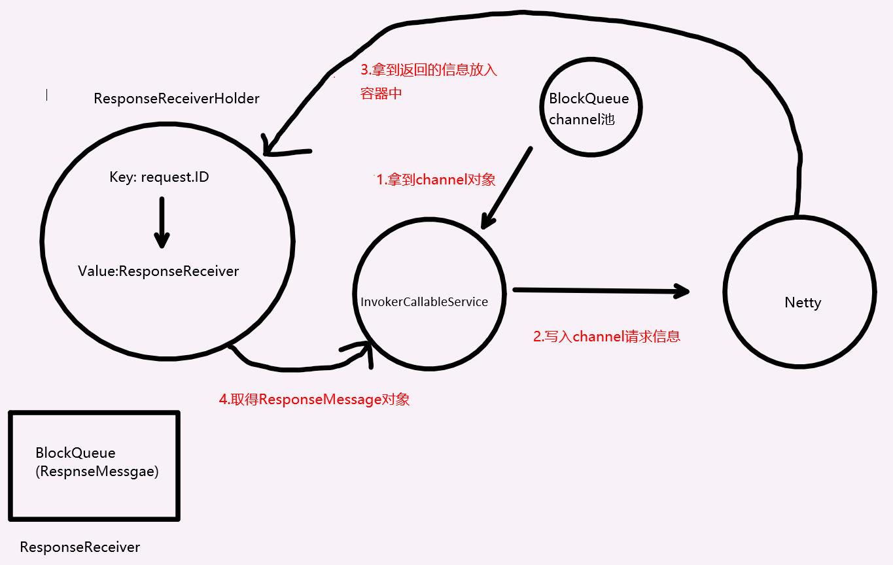
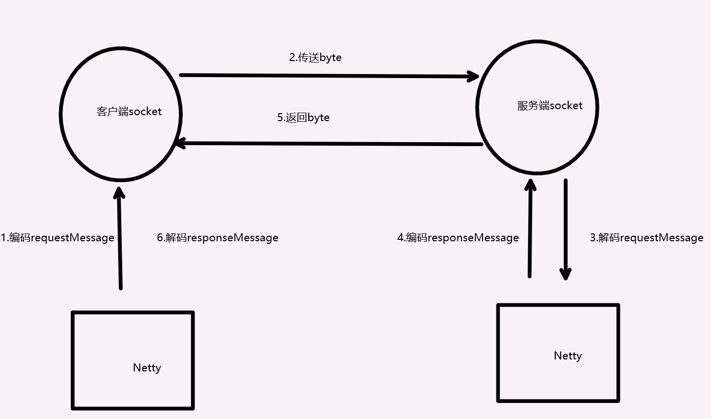
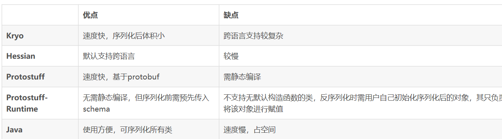

# SmallDubbo流程介绍

RPC（Remote Procedure Call)指的是指不同进程间的通信，为了解决分布式不同系统之间功能调用的问题，下面将以流程的方式伴以测试用例来分析具体情况

### 1.基本文件构建


首先创建接口类person（客户端，服务端共有）

```
public interface Person {
    public int cnt();
}
```

服务端编写接口类实现类man并注册到以service.xml文件为入口的spring中

```
public class man implements Person {

    @Override
    public int cnt() {
        return 1;
    }
}
```

客户端服务端编写properties文件（在README中已经介绍过就不介绍了）


### 2.服务端启动

启动代码，读取文件

```
Server server=new Server();
server.setProviderProperties("/service.properties");
```


这里可以看到所有的参数都输入到providerFactoryBean中，这是我们用来创建provider的类

```
public void setProviderProperties(String path)
  {
     // 实际将property都镀金providerFactoryBean中
      ProviderFactoryBean providerFactoryBean=new ProviderFactoryBean();
      Properties properties=new Properties();
      InputStream is = null;
      try {
          is = ZkConfigHelper.class.getResourceAsStream(path);
          if (null == is) {
              throw new IllegalStateException("service-properties can not found in the classpath.");
          }
          properties.load(is);
          providerFactoryBean.setId(Integer.parseInt(properties.getProperty("id")));
          providerFactoryBean.setServicePath(properties.getProperty("interface"));
          providerFactoryBean.setAppName(properties.getProperty("appName"));
          providerFactoryBean.setRef(properties.getProperty("ref"));
          providerFactoryBean.setServerPort(Integer.parseInt(properties.getProperty("serverPort")));
          providerFactoryBean.setWorkerThreads(Integer.parseInt(properties.getProperty("workerThreads")));
          //读取结束完成注册
          providerFactoryBean.afterPropertiesSet();
```


首先我们在providerFactoryBean中拿到数据开始注册开启相应端口提供服务（如果没有开启过，用并发map实现）

```
public void afterPropertiesSet() {
  
    providercenter.registerProvider(provider);
    NettyServer nettyServer = NETTY_SERVER_MAP.get(serverPort);
    // 如果缓存中没有这个端口,就开启服务
    if (null == nettyServer) {
        // 使用新的NettyServer开启服务,需要记录在本地缓存
        synchronized (ProviderFactoryBean.class) {
            // 可能会有多个服务对象绑定在同一端口，保证它们只能创建一个nettyServer
            if (null == NETTY_SERVER_MAP.get(serverPort)) {
                // 双重校验
                nettyServer = new NettyServer();
                nettyServer.start(serverPort);
                NETTY_SERVER_MAP.put(serverPort, nettyServer);
            }
        }
}
```


注册的时候，会在服务端注册中心维持个map类用于端口和服务的映射，并实时监听zookeeper下对应invoker端是否上线，（用并发set实现）

```
public void registerProvider(ProviderRegisterMessage provider) {
   ...省略上面代码
        // 为服务/invoker节点注册监听器,便于服务提供方获取该服务下的使用者(避免重复监听)
        if (firstAdd) {
            zkClient.subscribeChildChanges(invokerPath, new IZkChildListener() {
                @Override
                public void handleChildChange(String parentPath, List<String> currentChilds) throws Exception {
                    // 服务接口的全限定名
                    if (null == currentChilds || currentChilds.size() == 0) {
                        INVOKER_MAP.remove(nameSpace);
                        LOGGER.warn("[{}]节点发生变化,该服务节点下已无调用者", parentPath);
                        return;
                    }
                    // 监听到变化后invokerPath节点下的所有临时节点值是currentChilds
                    // 根据字符串节点值,还原Invoker
                    List<InvokerRegisterMessage> newInvokerList =new ArrayList();
                    for (String each : currentChilds) {
                        newInvokerList.add(JacksonUtils.jsonToObject(each, InvokerRegisterMessage.class));
                    }
                    // 更新invoker缓存
                    INVOKER_MAP.put(nameSpace, newInvokerList);
                }
            });
        }
    }
   省略下面代码
}
```


结束之后各模块状态如下图




### 3.客户端启动


这里前几步读取文件，构建invokerFactoryBean和服务端基本相同就不做赘余介绍了，在property构建后有会注册和提前为不同服务端地址构建通道（服务端信息拿去下面会说）


```
public void afterPropertiesSet() {
    // 将标签内容注册到zk中,同时获取标签内容的服务地址到本地
    InvokerRegisterMessage invoker = new InvokerRegisterMessage();
    invoker.setServicePath(targetInterface.getName());
    invoker.setAppName(appName);
    // 本机所有invoker的machineID是一样的
    // 根据标签内容从注册中心获取的地址
    List<ProviderRegisterMessage> providerRegisterMessages = registerCenter.registerInvoker(invoker);
    // 提前为不同的主机地址创建ChannelPool
    for (ProviderRegisterMessage provider : providerRegisterMessages) {
        InetSocketAddress socketAddress = new InetSocketAddress(provider.getServerIp(), provider.getServerPort());
        boolean firstAdd = socketAddressSet.add(socketAddress);
        if (firstAdd) {
            nettyChannelPoolFactory.registerChannelQueueToMap(socketAddress);
        }
    }
}
```

 

注册阶段，最重要的不同就是

1.拿到目前在zk已经上线的服务

2.需要zk实时监听服务端的上线并更新服务端列表在并发map中


```
public List<ProviderRegisterMessage> registerInvoker(InvokerRegisterMessage invoker) {
    ...省略
        if (null == PROVIDER_MAP.get(nameSpace)) {
            // 为每个服务注册监听器,实现服务自动发现
            zkClient.subscribeChildChanges(servicePath, new IZkChildListener() {
                @Override
                public void handleChildChange(String parentPath, List<String> currentChilds) throws Exception {
                    // 服务接口的全限定名
                    if (null == currentChilds || currentChilds.size() == 0) {
                        PROVIDER_MAP.remove(nameSpace);
                        LOGGER.warn("[{}]节点发生变化,该节点下已无可用服务", parentPath);
                        return;
                    }
                    // 监听到变化后servicePath节点下的所有临时节点值是currentChilds
                    List<ProviderRegisterMessage> newProviderList =new ArrayList<>();
                    for (String each : currentChilds) {
                        newProviderList.add(JacksonUtils.jsonToObject(each, ProviderRegisterMessage.class));
                    }
                    // 更新本地缓存的服务信息
                    PROVIDER_MAP.put(nameSpace, newProviderList);
                    LOGGER.info("[{}]节点发生变化,重新加载该节点下的服务信息如下", parentPath);
                    System.out.println(newProviderList);
                }
            });
        }
        // 获取服务节点下所有临时节点(服务注册信息列表)
        List<String> providerStrings = zkClient.getChildren(servicePath);
        // 根据注册信息字符串还原注册信息
        providerRegisterMessages = new ArrayList<>();
        for (String each : providerStrings) {
            providerRegisterMessages.add(JacksonUtils.jsonToObject(each, ProviderRegisterMessage.class));
        }
        // 将注册信息缓存到本地
        PROVIDER_MAP.put(nameSpace, providerRegisterMessages);
   ...省略
}
```


最后会在invokerFactoryBean中为接口生成代理对象

```
public Object getObject() {
    return ClientProxyFactory.getProxyInstance(appName, targetInterface, timeout, clusterStrategy);
}
```

结束之后各模块状态如下图




### 4.客户端开始RPC调用

首先拿到服务信息列表

```
String nameSpace = appName + "/" + serviceInterface.getName();
List<ProviderRegisterMessage> list=invokerRegisterCenter.getProviderMap().get(nameSpace);
if(list==null||list.size()==0)
{
    throw new NoSuchServiceException("没有可用节点");
}
```

调用properties设置好的**负载均衡算法**来选择调用服务端（细节最后说）

```
ProviderRegisterMessage providerRegisterMessage =LoadBalanceStorage.select(list,loadBalanceStrategy);
```

构建RequestMessage准备送入channel

```
RequestMessage request=new RequestMessage();
request.setServicePath(serviceInterface.getName());
request.setTimeout(consumeTimeout);
request.setTraceId(UUID.randomUUID().toString());

request.setRefId(providerRegisterMessage.getRefId());
request.setWorkerThread(providerRegisterMessage.getWorkerThread());
request.setMethodName(method.getName());
if (null != args && args.length > 0) {
    // 设置方法参数和类型(类型用于反射得到Method对象)
    request.setParameters(args);
    request.setParameterTypes(new String[args.length]);
    Type[] types = method.getGenericParameterTypes();
        for (int i = 0; i < args.length; i++) {
        // 所以当args参数是泛型时,需要寻找它的顶级type的类名
        if (types[i] instanceof ParameterizedType) {
            request.getParameterTypes()[i] = ((ParameterizedType) types[i]).getRawType().getTypeName();
        } else {
            request.getParameterTypes()[i] = types[i].getTypeName();
        }
    }
}
```

向任务池提交任务，并等待结果

```
result=fixedThreadPool.submit(new InvokerCallableService(inetSocketAddress,request));
try
{
    ResponseMessage response=result.get(consumeTimeout,TimeUnit.SECONDS);
    return response.getReturnValue();
}
```


下面是InvokerCallableService具体实现

1.在RespnseReceiverHolder中为请求创建对应的ResponseRecevier

2.拿到对应的channel队列（如果没有在上文中初始化创建则会在这里创建）

3.向netty中写入请求信息

4.阻塞等待结果放入RespnseReceiverHolder中的结果

5.释放channel

```
public ResponseMessage call() throws InterruptedException {
    // 创建返回结果包装类,并存入返回结果容器
    ResponseReceiverHolder.initResponseData(request.getTraceId());
    // 根据本地调用服务提供者地址获取对应的Netty通道channel队列
    ArrayBlockingQueue<Channel> blockingQueue = NettyChannelPoolFactory.getInstance().acquire(inetSocketAddress);
    try {
        if (null == channel) {
            // 先尝试从ChannelPool阻塞队列中获取一个可用的Channel
            channel = blockingQueue.poll(100, TimeUnit.MILLISECONDS);
        }
        // 取出来无效或取不到则重新创建一个(需要while循环,因为创建Channel可能失败)
        while (null == channel || !channel.isOpen() || !channel.isActive() || !channel.isWritable()) {
            channel = NettyChannelPoolFactory.getInstance().registerChannel(inetSocketAddress);
        }
        // 将本次调用的信息写入Netty通道,发起异步调用
        LOGGER.info("客户端发送请求消息:[content:{} id:{}]", request, request.getTraceId());
        ChannelFuture channelFuture = channel.writeAndFlush(request);
        channelFuture.syncUninterruptibly();
        // 从结果包装类容器中取结果,会同步阻塞
        return ResponseReceiverHolder.getValue(request.getTraceId(), request.getTimeout());
    } catch (InterruptedException e) {
        LOGGER.error("请求超时,线程已中断!", e);
        throw new InterruptedException();
    } finally {
        // 本次调用完毕后,将channel重新释放到队列中,以便下次复用
        NettyChannelPoolFactory.getInstance().release(blockingQueue, channel, inetSocketAddress);
    }
}
```


如果文字不清楚的可以看下图客户端流程




### 5.服务端提供服务

配置的Netty handler处理器根据信号量限流处理请求

```
protected void channelRead0(ChannelHandlerContext ctx, RequestMessage request) throws RuntimeException {
    long startTime = System.currentTimeMillis();
    LOGGER.info("服务端接收请求消息:[content:{} id:{}]", request, request.getTraceId());
    if (ctx.channel().isWritable()) {
        long consumeTimeOut = request.getTimeout();
        // 根据方法名称定位到具体某一个服务提供者
        String serviceKey = request.getRefId();
        // 进行限流设置
        int workerThread = request.getWorkerThread();
        Semaphore semaphore = SERVICE_KEY_SEMAPHORE_MAP.get(serviceKey);
        if (null == semaphore) {
            synchronized (SERVICE_KEY_SEMAPHORE_MAP) {
                semaphore = SERVICE_KEY_SEMAPHORE_MAP.get(serviceKey);
                if (null == semaphore) {
                    semaphore = new Semaphore(workerThread);
                    SERVICE_KEY_SEMAPHORE_MAP.put(serviceKey, semaphore);
                }
            }
        }
        ResponseMessage response = null;
        boolean acquire = false;
        try {
            // 利用semaphore实现限流
            acquire = semaphore.tryAcquire(consumeTimeOut, TimeUnit.MILLISECONDS);
            if (acquire) {
                // 利用反射发起服务调用
                response = ProviderService.execute(request);
            } else {
                LOGGER.warn("服务限流,请求超时!");
                throw new ServiceOvertimeException("调用服务超时");

            }
```

这个时候在服务端前面spring注册的接口实现类就派上用场了，从RequestMessage信息中拿到refid即可对应目标实现，再用参数类型列表拿到目标方法，反射invoke调用就行，最后再封装到ResponseMessage即可，这里比较简单就不画图了 ：）

```
public class ProviderService {
    private static final ClassPathXmlApplicationContext CONTEXT = new ClassPathXmlApplicationContext("service.xml");
    public static ResponseMessage execute(RequestMessage request) throws ClassNotFoundException {
        // 从IOC容器中获取接口实现类对象
        Object provider = CONTEXT.getBean(request.getRefId());
        // 确定方法参数的Class列表,用于获取Method对象
        Class<?>[] parameterClasses = null;
        String[] parameterTypes = request.getParameterTypes();
        if (null != parameterTypes && parameterTypes.length > 0) {
            parameterClasses = new Class<?>[parameterTypes.length];
            for (int i = 0; i < request.getParameterTypes().length; i++) {
                try {
                    parameterClasses[i] = Class.forName(request.getParameterTypes()[i]);
                } catch (ClassNotFoundException e) {
                    LOGGER.error("未找到该方法参数的类型:" + request.getParameterTypes()[i]);
                    e.printStackTrace();
                    throw new ClassNotFoundException();
                }
            }
        }
        try {
            Method method = provider.getClass().getMethod(request.getMethodName(), parameterClasses);
            Object returnValue = method.invoke(provider, request.getParameters());
            ResponseMessage responseMessage = new ResponseMessage();
            responseMessage.setReturnValue(returnValue);
            responseMessage.setTraceId(request.getTraceId());
            responseMessage.setTimeout(request.getTimeout());
            return responseMessage;
        } catch (NoSuchMethodException e) {
            LOGGER.error("该方法不存在:" + request.getMethodName());
            throw new RuntimeException("反射调用服务时,发生错误");
        } catch (InvocationTargetException e) {
            throw new RuntimeException("反射调用服务时,发生错误");
        } catch (IllegalAccessException e) {
            LOGGER.error("无法访问该方法:" + request.getMethodName());
            throw new RuntimeException("反射调用服务时,发生错误");
        }
    }
}
```


### 6.客户端处理服务端的返回

拿到responseMessage后直接放入容器中即可，这里在客户端的图中也有显示

```
protected void channelRead0(ChannelHandlerContext channelHandlerContext, ResponseMessage response) throws Exception {
    // Netty异步获取结果后的操作:存入结果阻塞队列
    ResponseReceiverHolder.putResultValue(response);
    LOGGER.info("客户端接收返回结果:[content:{} id:{}]", response, response.getTraceId());
}
```


这样整个流程就结束了，但其中还有些问题没有讲述


### Netty处理流程



#### **编码部分**

其中通过定义好传输结构来解决粘包问题

**传输结构=4字节序列化方法的数字索引+4字节消息长度+消息**

```
protected void encode(ChannelHandlerContext ctx, Object msg, ByteBuf out) throws Exception {
    int serializerCode = SerializerAdapter.getCodeByType(serializerType);
    out.writeInt(serializerCode);
    // 将对象序列化为字节数组
    byte[] data = SerializerAdapter.serialize(msg, serializerType);
    // 将字节数组(消息体)的长度作为消息头写入,解决半包/粘包问题
    out.writeInt(data.length);
    // 最后才写入序列化后得到的字节数组
    out.writeBytes(data);
}
```

#### **解码部分**

```
protected void decode(ChannelHandlerContext ctx, ByteBuf in, List<Object> out) throws Exception {
    if (in.readableBytes() < 8) {
        return;
    }
    in.markReaderIndex();
    int serializerCode = in.readInt();
    String serializerType = SerializerAdapter.getTypeByCode(serializerCode);
    int dataLength = in.readInt();
    if (dataLength < 0) {
        ctx.close();
    }
    // 若当前可以获取到的字节数小于实际长度,则直接返回,直到当前可以获取到的字节数等于实际长度
    if (in.readableBytes() < dataLength) {
        in.resetReaderIndex();
        return;
    }
    // 读取完整的消息体字节数组
    byte[] data = new byte[dataLength];
    in.readBytes(data);

    // 将字节数组反序列化为java对象(SerializerEngine参考序列化与反序列化章节)
    Object obj = SerializerAdapter.deserialize(data, TargetClass, serializerType);
    out.add(obj);
}
```


### 序列化

序列化可选**Hessian**和**ProtoStuff**两种（我对序列化方法不是特别了解，这里就直接粘贴网上的比较了）




还有一种基于Json的序列化方法，但是其中传输的时候会损失掉类型信息，而且对于复杂类型的反序列化编写较复杂所以就没有采用


### 负载均衡

SmallDubbo一共实现了5种负载均衡方法，下面将一一介绍


 **Random** 

随机算法直接random即可

```
public ProviderRegisterMessage select(List<ProviderRegisterMessage> messages) {
    int index = RandomUtils.nextInt(0, messages.size());
    return messages.get(index);
}
```

 **WeightRandom** 

权重随机，根据每个提供者的权重创建新的list，最后随机

```
public ProviderRegisterMessage select(String namespace) {
    List<ProviderRegisterMessage>messages=LoadBalanceStorage.getProviderMap(namespace);
    // 根据加权创建服务列表索引:加权为3,则它的索引在这个数组中出现三次
    List<ProviderRegisterMessage> indexList = getIndexListByWeight(messages);
    int index = RandomUtils.nextInt(0, indexList.size());
    return indexList.get(index);
}
public  List<ProviderRegisterMessage> getIndexListByWeight(List<ProviderRegisterMessage> providerServices) {
    if (null == providerServices | providerServices.size() == 0) {
        throw  new EmptyProviderListException("无服务提供者信息");
    }
    ArrayList<ProviderRegisterMessage> list = new ArrayList();
    int index = 0;
    for (ProviderRegisterMessage each : providerServices) {
        int weight = each.getWeight();
        while (weight-- > 0) {
            list.add(each);
        }
        index++;
    }
    return list;
}
```

 **WeightPolling** 

权重轮询，根据每个提供者的权重创建新的list，最后根据在LoadBalanceStorage中维持得出WEIGHTPOOLINGMAP找到对应服务的index

```
ublic ProviderRegisterMessage select(String namespace) {

        List<ProviderRegisterMessage>messages=LoadBalanceStorage.getProviderMap(namespace);
        ProviderRegisterMessage registerMessage = null;
                List<ProviderRegisterMessage> indexList = getIndexListByWeight(messages);
        Index index=LoadBalanceStorage.getWEIGHTPOOLINGMAP().get(namespace);
        synchronized (index)
        {
            int cnt=index.getValue();
                // 若计数大于服务提供者个数,将计数器归0
                if (cnt >= indexList.size()) {
                    cnt = 0;
                }
                registerMessage = indexList.get(cnt);
                index.setValue(cnt++);
            }
            // 根据加权创建服务列表索引:加权为3,则它的索引在这个数组中出现三次
        return  registerMessage;
    }
    public  List<ProviderRegisterMessage> getIndexListByWeight(List<ProviderRegisterMessage> providerServices) {
        if (null == providerServices | providerServices.size() == 0) {
            throw  new EmptyProviderListException("无服务提供者信息");
        }
        ArrayList<ProviderRegisterMessage> list = new ArrayList();
        int index = 0;
        for (ProviderRegisterMessage each : providerServices) {
            int weight = each.getWeight();
            while (weight-- > 0) {
                list.add(each);
            }
            index++;
        }
        return list;
    }
```


**Polling** 

轮询，LoadBalanceStorage中维持得出POOLINGMAP找到对应服务的index

```
public ProviderRegisterMessage select(String namespace) {
        List<ProviderRegisterMessage>messages=LoadBalanceStorage.getProviderMap(namespace);

        ProviderRegisterMessage registerMessage=null;
//        防止并发影响
        Index index=LoadBalanceStorage.getPoolingMap().get(namespace);
        synchronized (index)
        {
            int cnt=index.getValue();
            if (cnt >= messages.size()) {
                cnt = 0;
            }
            registerMessage = messages.get(cnt);
            index.setValue(cnt++);
        }
            return  registerMessage;

    }
```


**Hash**

hash算法，根据本机IP对应的hashcode与size取余来计算对应服务，基本以后就以此地址作为服务入口了

```
public ProviderRegisterMessage select(String namespace) {
    List<ProviderRegisterMessage>messages= LoadBalanceStorage.getProviderMap(namespace);
    // 获取调用方ip
    String localIP = IPHelper.localIp();
    // 获取源地址对应的hashcode
    int hashCode = localIP.hashCode();
    // 获取服务列表大小
    int size = messages.size();
    return messages.get(hashCode % size);
}
```


